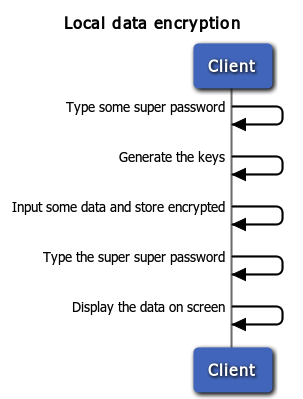

# Status: Experimental

# AeroGear Crypto API

**Note**: This document is a working progress if you strongly disagree with something, fix it.

# Authors

* Bruno Oliveira
* Corinne Krych
* Douglas Campos
* Matthias Wessendorf

# Goals

* User friendly interface for non crypto experts.
* Enable advanced developers can make use of the pure crypto provider implementation.

# Supported Algorithms

* PBKDF2 for password based key derivation
* AES with GCM for symmetric encryption

# API symmetry 

## JavaScript

AeroGear JS make use of [sjcl](http://crypto.stanford.edu/sjcl/) with wrappers for basic functionalities like: encrypt, decrypt, password salting and key pair generation. The crypto bits were built ina separated module so it can be included/excluded in a custom build.

* Password based key derivation support (PBKDF2)

    var myKey = AeroGear.Crypto().deriveKey( 'strong' );

* Symmetric encryption support (GCM)

    * Encryption:

            var options = {
                IV: superRandomInitializationVector,
                AAD: "whateverAuthenticatedData",
                key: generatedKey,
                data: "My bonnie lies over the ocean"
            };
            
            var ciphertext = AeroGear.Crypto().encrypt( options );

    * Decryption:

            var options = {
                IV: superRandomInitializationVector,
                AAD: "whateverAuthenticatedData",
                key: generatedKey,
                data: cipherText
            };

            var plainText = AeroGear.Crypto().decrypt( options );;
            

## Android

The android platform unfortunately ships a incomplete and outdated version of [Bouncy Castle for Android](https://code.google.com/p/android/issues/detail?id=3280) which also makes hard to install an updated version of the library. That said, we had to stick with [Spongy Castle](http://rtyley.github.io/spongycastle/), a version of [Bouncy Castle](http://www.bouncycastle.org) repackaged to make it work on Android.


* Password based key derivation support (PBKDF2)

        Pbkdf2 pbkdf2 = AeroGearCrypto.pbkdf2();
        byte[] rawKey = pbkdf2.encrypt(PASSWORD);

* Symmetric encryption support (GCM)

    * Encryption:

            //Generate the key
            Pbkdf2 pbkdf2 = AeroGearCrypto.pbkdf2();
            byte[] privateKey = pbkdf2.encrypt("passphrase");
    
            //Initializes the crypto box
            CryptoBox cryptoBox = new CryptoBox(privateKey);
    
            //Encryption
            byte[] IV = new Random().randomBytes();
            byte[] ciphertext = cryptoBox.encrypt(IV, "My bonnie lies over the ocean");
    
    * Decryption:

            //Decryption
            CryptoBox pandora = new CryptoBox(privateKey);
            byte[] message = pandora.decrypt(IV, ciphertext);            


## iOS

The iOS bits were implemented on top of [Common Crypto](https://developer.apple.com/library/mac/documentation/security/conceptual/cryptoservices/GeneralPurposeCrypto/GeneralPurposeCrypto.html) and also make use of the [Security Framework](https://developer.apple.com/library/ios/documentation/Security/Reference/SecurityFrameworkReference/_index.html)

* Password based key derivation support (PBKDF2)

        @interface AGPBKDF2 : NSObject
        - (NSData *)deriveKey:(NSString *)password;
        - (NSData *)deriveKey:(NSString *)password salt:(NSData *)salt;
        - (NSData *)deriveKey:(NSString *)password salt:(NSData *)salt iterations:(NSInteger)iterations;
        - (BOOL)validate:(NSString *)password encryptedPassword:(NSData *)encryptedPassword salt:(NSData *)salt;
        - (NSData *)salt;
        @end

* Symmetric encryption support (CBC)

**NOTE:** AES GCM Mode is not publicly supported by CommonCrypto (Part of a [private interface](https://github.com/Apple-FOSS-Mirror/CommonCrypto/blob/master/Source/CommonCryptoSPI/CommonCryptorSPI.h#L71) ). We start first with exposing Mode AES CBC.


        @interface AGCryptoBox : NSObject
        - (id)initWithKey:(NSData *)key;
        - (NSData *)encrypt:(NSData *)data IV:(NSData *)IV;
        - (NSData *)decrypt:(NSData *)data IV:(NSData *)IV;
        @end

# Scenarios

**Note**: For all scenarios the authentication process was intentionally ignored. 

## Local data encryption 

* An user wants to store sensitive data on mobile device and the data must be protected

For this scenario we will make use of *symmetric ciphers* to encrypt/decrypt the local data, of course an efficient way to properly store the key must be evaluated and the key should never be shared with others. 

The API *can't* encourage developers to commit some common mistakes like predictable key, IV or salt, that said the API must be responsible for the entropy behind the scenes and as well generate these values. 

By default the API will provide *AES* with *GCM*, if for some reason the crypto provider doesn't have any support for these modes, *CBC* or *CTR*  must be replacement and the change explicitly documented.

**Note**: The following solution doesn't prevent an attacker from extract the data via USB and try to break the encryption. 




# Demo application workflow

The demo app ```AeroGear Crypto``` is a single app that let you easily create alisaes and encrypted passwords and store them in an encrypted database that only you can access. One central point for all your passwords.

For the initial release, the flow to change master password will not be implemented.

Video links: 

* For [Android client](http://vimeo.com/77804314)

* For [iOS client](http://vimeo.com/78366502) 
